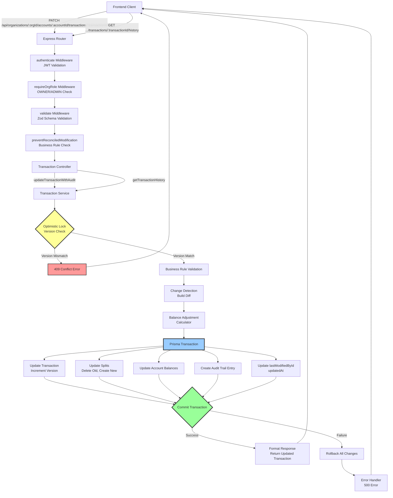
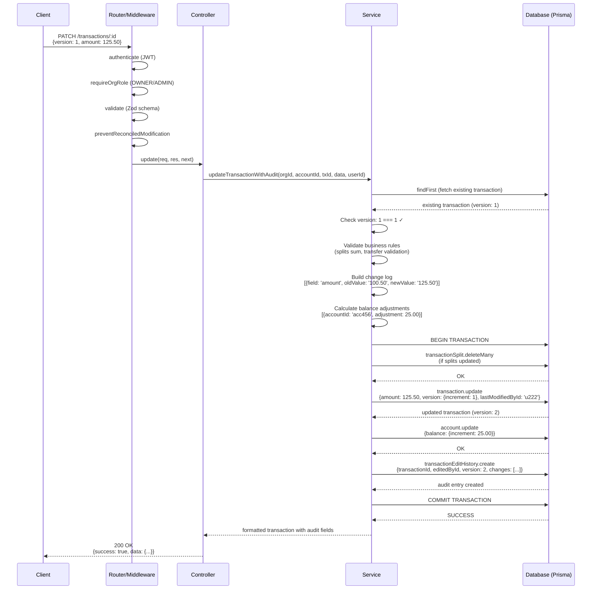
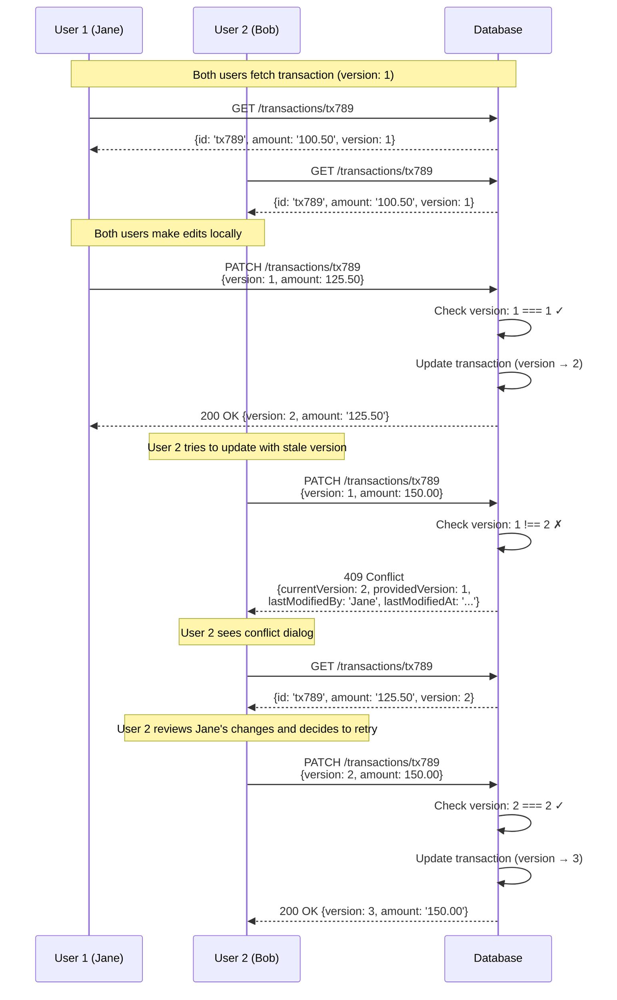
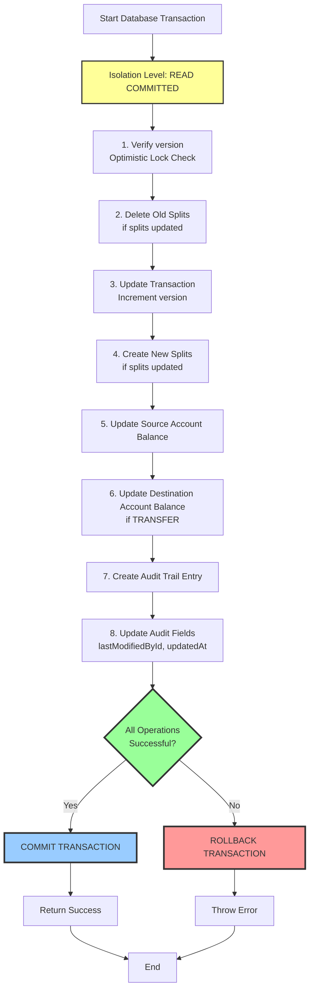
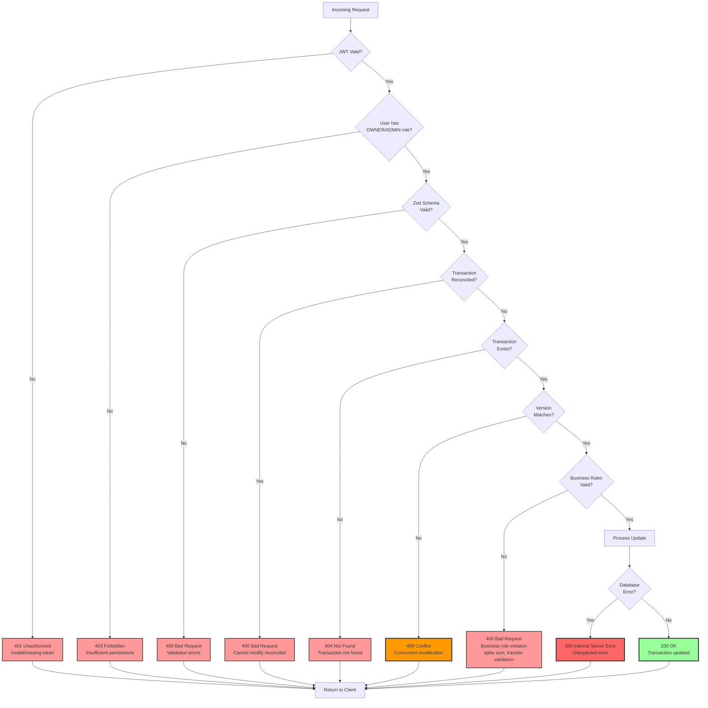
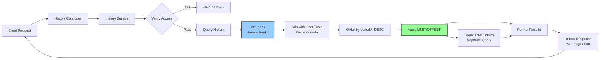
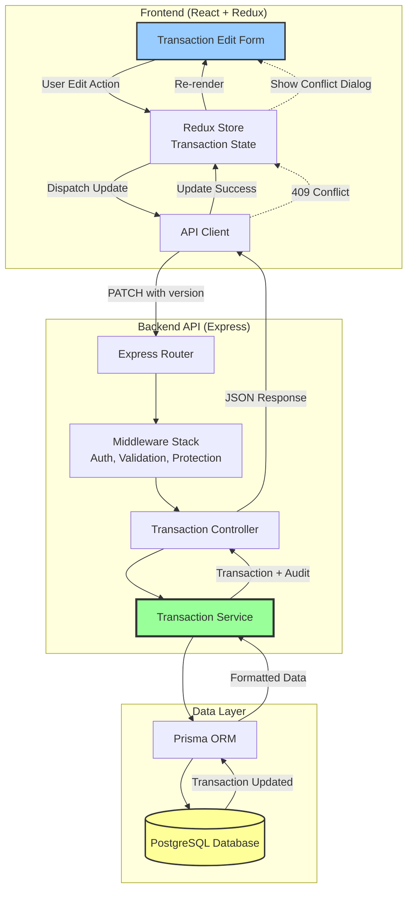
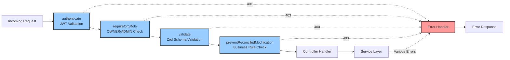

# Transaction Edit Architecture

## Service Layer Architecture Diagram



## Data Flow: Transaction Update with Audit Trail



## Concurrent Modification Handling



## Balance Adjustment Logic Flow

```mermaid
graph TD
    Start[Start Balance Adjustment] --> GetTypes{Determine Old & New<br/>Transaction Types}

    GetTypes --> TT_TT{TRANSFER → TRANSFER?}
    GetTypes --> TE_TE{INCOME/EXPENSE → INCOME/EXPENSE?}
    GetTypes --> T_TE{TRANSFER → INCOME/EXPENSE?}
    GetTypes --> TE_T{INCOME/EXPENSE → TRANSFER?}

    TT_TT --> CheckDest{Destination<br/>Changed?}
    CheckDest -->|Yes| ReverseDest[Reverse Old Destination<br/>Apply New Destination]
    CheckDest -->|No| CheckAmount{Amount<br/>Changed?}
    CheckAmount -->|Yes| AdjustDest[Adjust Destination Balance]
    CheckAmount -->|No| AdjustSource[Adjust Source Balance<br/>for Amount/Fee Delta]

    ReverseDest --> ApplyAdj[Apply All Adjustments]
    AdjustDest --> ApplyAdj
    AdjustSource --> ApplyAdj

    TE_TE --> CalcOldImpact[Calculate Old Impact<br/>INCOME: +amount - fee<br/>EXPENSE: -(amount + fee)]
    CalcOldImpact --> CalcNewImpact[Calculate New Impact]
    CalcNewImpact --> CalcDelta[Delta = New - Old]
    CalcDelta --> ApplyAdj

    T_TE --> ReverseTransfer[Reverse Transfer<br/>+source, -destination]
    ReverseTransfer --> ApplyNewType[Apply New INCOME/EXPENSE]
    ApplyNewType --> ApplyAdj

    TE_T --> ReverseOldType[Reverse Old INCOME/EXPENSE]
    ReverseOldType --> ApplyTransfer[Apply Transfer<br/>-source, +destination]
    ApplyTransfer --> ApplyAdj

    ApplyAdj --> End[End]

    style TT_TT fill:#ff9,stroke:#333,stroke-width:2px
    style TE_TE fill:#9f9,stroke:#333,stroke-width:2px
    style T_TE fill:#f9f,stroke:#333,stroke-width:2px
    style TE_T fill:#9ff,stroke:#333,stroke-width:2px
    style ApplyAdj fill:#9cf,stroke:#333,stroke-width:3px
```

## Change Detection Process

```mermaid
graph LR
    Start[Existing Transaction] --> Compare{Compare Fields}

    Compare --> Memo{memo<br/>changed?}
    Compare --> Amount{amount<br/>changed?}
    Compare --> Type{transactionType<br/>changed?}
    Compare --> Date{date<br/>changed?}
    Compare --> Vendor{vendorId<br/>changed?}
    Compare --> Destination{destinationAccountId<br/>changed?}
    Compare --> Fee{feeAmount<br/>changed?}
    Compare --> Splits{splits<br/>changed?}

    Memo -->|Yes| AddChange1[Add to changes:<br/>{field: 'memo', oldValue, newValue}]
    Amount -->|Yes| AddChange2[Add to changes:<br/>{field: 'amount', oldValue, newValue}]
    Type -->|Yes| AddChange3[Add to changes:<br/>{field: 'transactionType', oldValue, newValue}]
    Date -->|Yes| AddChange4[Add to changes:<br/>{field: 'date', oldValue, newValue}]
    Vendor -->|Yes| AddChange5[Add to changes:<br/>{field: 'vendorId', oldValue, newValue}]
    Destination -->|Yes| AddChange6[Add to changes:<br/>{field: 'destinationAccountId', oldValue, newValue}]
    Fee -->|Yes| AddChange7[Add to changes:<br/>{field: 'feeAmount', oldValue, newValue}]
    Splits -->|Yes| AddChange8[Add to changes:<br/>{field: 'splits', oldValue[], newValue[]}]

    Memo -->|No| Skip1[Skip]
    Amount -->|No| Skip2[Skip]
    Type -->|No| Skip3[Skip]
    Date -->|No| Skip4[Skip]
    Vendor -->|No| Skip5[Skip]
    Destination -->|No| Skip6[Skip]
    Fee -->|No| Skip7[Skip]
    Splits -->|No| Skip8[Skip]

    AddChange1 --> Aggregate[Aggregate All Changes]
    AddChange2 --> Aggregate
    AddChange3 --> Aggregate
    AddChange4 --> Aggregate
    AddChange5 --> Aggregate
    AddChange6 --> Aggregate
    AddChange7 --> Aggregate
    AddChange8 --> Aggregate

    Skip1 --> End
    Skip2 --> End
    Skip3 --> End
    Skip4 --> End
    Skip5 --> End
    Skip6 --> End
    Skip7 --> End
    Skip8 --> End

    Aggregate --> CreateAudit[Create Audit Trail Entry<br/>with changes array]
    CreateAudit --> End[End]

    style Compare fill:#ff9,stroke:#333,stroke-width:2px
    style Aggregate fill:#9cf,stroke:#333,stroke-width:3px
    style CreateAudit fill:#9f9,stroke:#333,stroke-width:3px
```

## Database Transaction Isolation



## Error Handling Flow



## Audit Trail Query Performance



## Component Integration



## Middleware Stack



## Key Design Decisions

### 1. Optimistic Locking Strategy

**Decision**: Use version field incremented on every update

**Rationale**:
- Prevents lost updates without database-level locking
- Scales well with concurrent users
- Provides clear feedback to users about conflicts
- Simple to implement with Prisma

**Trade-offs**:
- Requires client to track version field
- May increase user friction on high-concurrency edits
- Client must handle 409 conflicts gracefully

### 2. Audit Trail Storage

**Decision**: Separate `TransactionEditHistory` table with JSONB changes field

**Rationale**:
- Flexible schema for storing different types of changes
- Efficient storage of sparse change sets
- Easy to query full history for a transaction
- PostgreSQL JSONB provides indexing and query capabilities

**Trade-offs**:
- More complex queries for field-specific history
- Requires careful formatting of change data
- Storage overhead for each edit

### 3. Balance Adjustment Approach

**Decision**: Calculate delta and apply in single transaction

**Rationale**:
- Maintains account balance accuracy
- ACID guarantees prevent inconsistencies
- Handles all transaction type transitions
- Rollback protection on failures

**Trade-offs**:
- Complex logic for type transitions (TRANSFER ↔ INCOME/EXPENSE)
- Requires careful testing of all scenarios
- Performance impact on large transactions (mitigated by Prisma)

### 4. Authorization Model

**Decision**: OWNER/ADMIN for edits, any member for viewing history

**Rationale**:
- Protects financial data from unauthorized changes
- Aligns with organization role hierarchy
- Transparency: all members can view audit trail
- Compliance: maintains accountability

**Trade-offs**:
- May be too restrictive for some organizations
- No per-transaction permissions
- Could add MEMBER edit permission with approval workflow

### 5. Error Response Structure

**Decision**: Structured error responses with field-level errors and conflict metadata

**Rationale**:
- Enables rich client-side error handling
- Provides context for conflict resolution
- Consistent format across all endpoints
- Supports internationalization

**Trade-offs**:
- More verbose response payloads
- Requires client-side parsing logic
- May expose internal state (mitigated by selective exposure)

## Performance Considerations

### Database Indexes

Required indexes for efficient queries:

1. **Transaction.version**: Optimistic lock checks
2. **Transaction.accountId + status**: List queries
3. **TransactionEditHistory.transactionId**: History queries
4. **TransactionEditHistory.editedAt**: Chronological ordering
5. **TransactionEditHistory.editedById**: User-specific history

### Query Optimization

1. **Lazy Loading**: Only fetch audit history when explicitly requested
2. **Pagination**: Limit history queries with OFFSET/LIMIT
3. **Index Usage**: All history queries use indexed fields
4. **Connection Pooling**: Reuse database connections (Prisma default)
5. **Transaction Batching**: Single DB transaction for all updates

### Caching Strategy

Potential caching opportunities:

1. **Transaction List**: Cache with invalidation on updates
2. **User Info**: Cache user name/email lookups (rarely change)
3. **Category Info**: Cache category data (infrequent changes)
4. **Read Replicas**: Route GET requests to replicas (future)

Not recommended to cache:
- Individual transaction data (frequently updated)
- Audit history (integrity critical)

## Security Considerations

### Input Validation

1. **Zod Schema**: Type safety and format validation
2. **Business Rules**: Middleware enforcement
3. **SQL Injection**: Parameterized queries via Prisma
4. **XSS**: Output encoding (handled by JSON responses)

### Authorization

1. **JWT Verification**: Every request authenticated
2. **Role Checks**: Middleware-enforced RBAC
3. **Resource Ownership**: Service layer verifies org membership
4. **Audit Logging**: All changes tracked with user ID

### Data Integrity

1. **Optimistic Locking**: Prevents concurrent modification issues
2. **Database Transactions**: ACID guarantees
3. **Foreign Key Constraints**: Referential integrity
4. **Version Incrementing**: Monotonic version numbers

### Privacy & Compliance

1. **Audit Trail**: Immutable change log for compliance
2. **User Tracking**: Record who made changes and when
3. **IP/User Agent**: Optional metadata for security analysis
4. **Data Retention**: History retained indefinitely (configurable)

## Testing Strategy

### Unit Tests

1. **Change Detection**: Test diff generation for all field types
2. **Balance Calculation**: Test all transaction type transitions
3. **Validation Rules**: Test business rule enforcement
4. **Error Handling**: Test error response formatting

### Integration Tests

1. **Optimistic Locking**: Concurrent update scenarios
2. **Balance Accuracy**: Verify account balances after edits
3. **Audit Trail**: Verify history entries created correctly
4. **Authorization**: Test role-based access control

### End-to-End Tests

1. **Happy Path**: Simple update flow
2. **Conflict Resolution**: User handles 409 error
3. **Reconciled Protection**: Cannot edit reconciled transactions
4. **History Viewing**: Full audit trail retrieval

### Load Tests

1. **Concurrent Edits**: Multiple users editing different transactions
2. **Conflict Rate**: Measure optimistic lock failures under load
3. **Database Performance**: Query response times with large history
4. **API Throughput**: Requests per second capacity
